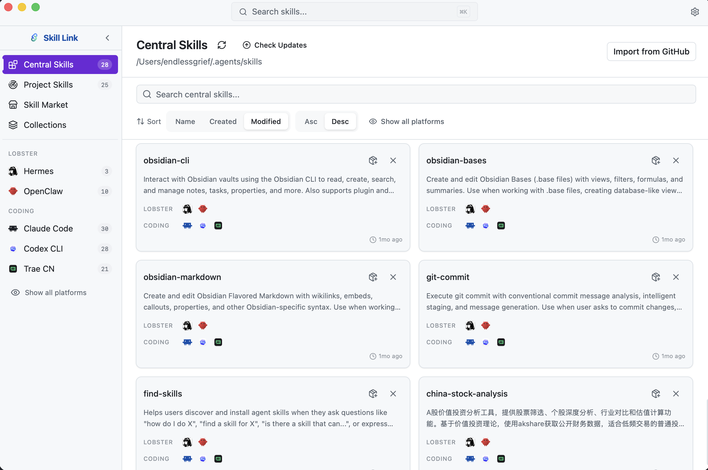
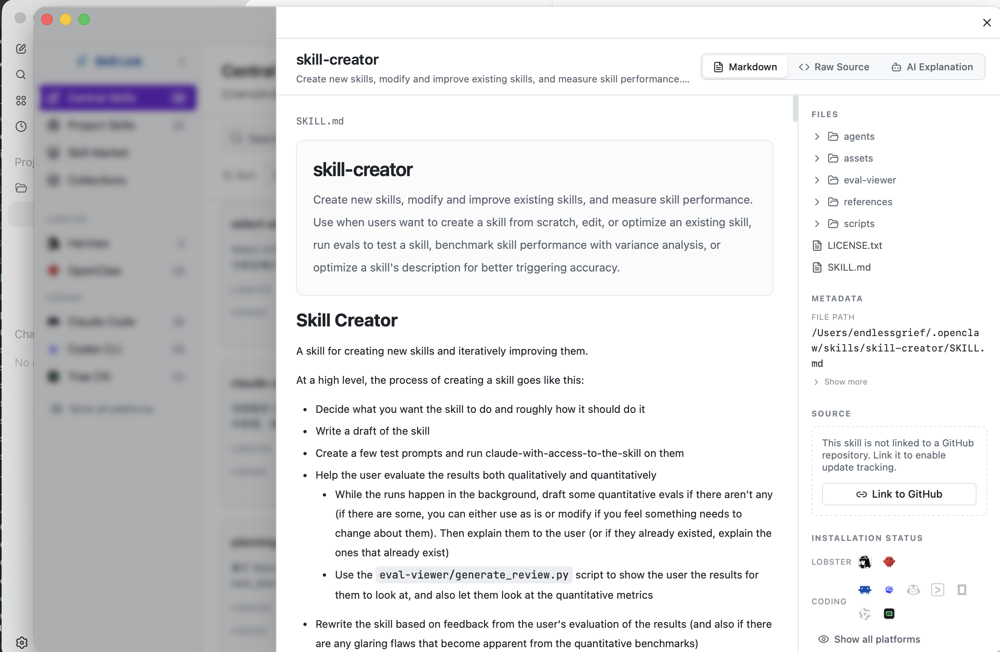
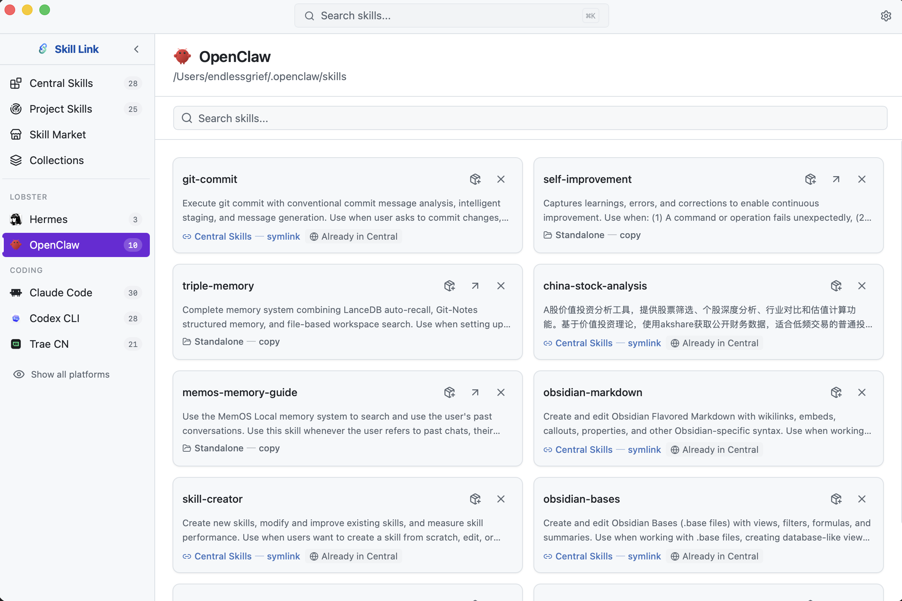
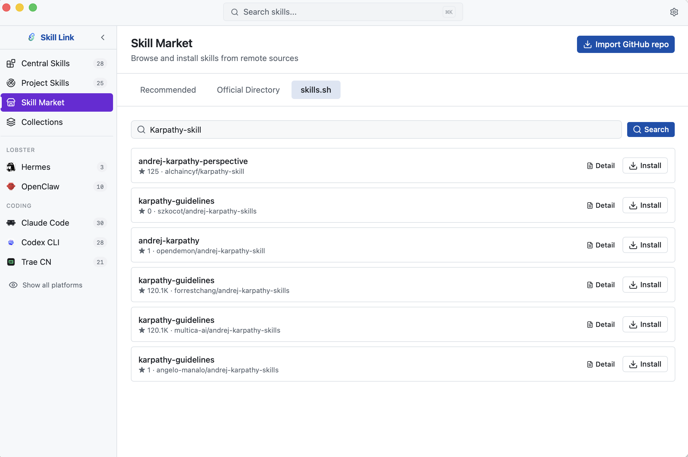

# Skill Link

Skill Link is a local-first desktop app for keeping AI agent skills in one central library, then linking them into the tools and projects where you actually use them.

[English](README.md) | [中文文档](README_CN.md)

---

> **Acknowledgments**
>
> Skill Link is a hard fork of [skills-manage](https://github.com/iamzhihuix/skills-manage) by [iamzhihuix](https://github.com/iamzhihuix), a fantastic cross-platform Skills manager. This project extends the original with additional features, different design choices, and ongoing development in its own direction.

> **Disclaimer**
>
> Skill Link is an independent, unofficial desktop application for managing local skill directories and importing public skill metadata. It is not affiliated with, endorsed by, or sponsored by Anthropic, OpenAI, GitHub, MiniMax, or any other supported platform, publisher, or trademark owner.

## Why It Exists

AI coding tools now share a simple pattern: a skill is a folder with a `SKILL.md` file and optional supporting files. The problem is that every tool puts those folders somewhere different.

Skill Link treats `~/.agents/skills/` as the canonical source of truth. From there, it can symlink or copy skills into Claude Code, Codex CLI, Cursor, OpenCode, Gemini CLI, Kiro, Windsurf, Lobster-family tools, custom platforms, and project-local skill folders.

## What You Can Do

- Build one central skill library under `~/.agents/skills/`.
- Install or uninstall skills across supported platforms with platform icon toggles.
- Install central skills into project-local skill directories or any custom target path.
- Import skills from GitHub repositories, official directories, skill.sh, or local project scans.
- Track GitHub-backed skills, check for updates, and apply one-click updates with backups.
- Link existing local skills back to a GitHub source for future update checks.
- Browse every file inside a skill, not only `SKILL.md`.
- Organize reusable sets of skills as collections and batch-install them.
- Keep metadata, settings, collections, and scan results in a local SQLite database.

## Recent Direction

Recent work has moved Skill Link from a basic cross-platform installer into a fuller skill lifecycle tool:

- **Project installs** - central skills can now be linked into a selected project using each platform's project skill directory convention.
- **Custom path installs** - a skill can be linked or copied into an arbitrary target directory when a tool is not built in yet.
- **GitHub update flow** - imported skills remember source repo, source path, branch/ref, and installed commit, so Skill Link can compare against the latest upstream commit.
- **One-click updates** - updateable skills are refreshed from their source with validation, local backups, and rollback behavior if activation fails.
- **Link local skill to GitHub** - older or manually created skills can be connected to a GitHub source without re-importing.
- **Safer central deletion** - central skill removal also cleans tracked installs while avoiding untracked real directories.
- **Cleaner detail view** - metadata is collapsible, GitHub source information is more prominent, and duplicate/read-only sources are easier to compare.

## Skill Sources

| Source | What it is for |
|--------|----------------|
| Central library | Existing skills in `~/.agents/skills/` |
| GitHub import | Public repositories, including root-level skills and `skills/` directories |
| skill.sh | Search skill.sh, inspect remote directories, and install directly |
| Official directories | Publisher/registry-style skill listings |
| Project scan | Find unmanaged `SKILL.md` folders on disk and centralize them |
| Custom paths | Bring in skills from user-selected directories |

## Screenshots

### Central skills and platform installs



### Skill detail and file tree



### Platform skill view



### Find Skill



### GitHub import


### Project skill discovery


## Download

- Latest release: <https://github.com/EndlessGr1ef/skill-link/releases/latest>
- Current prebuilt packages: Apple Silicon macOS (`.dmg` and `.app.zip`)
- Other platforms: run from source for now

### macOS Unsigned Build

The current public macOS build is not notarized. If macOS shows a warning such as:
- `"Skill Link" is damaged and can't be opened`
- `"Skill Link" cannot be opened because Apple could not verify it`

the app is usually not corrupted; it is being blocked by Gatekeeper quarantine on an unsigned build.

After moving the app to `/Applications`, run:

```bash
xattr -dr com.apple.quarantine "/Applications/Skill Link.app"
```

Then launch the app again from Finder. If your app is stored somewhere else, replace the path with the actual `.app` path.

## Supported Platforms

| Category | Platform | Global Skills Directory | Project Directory |
|----------|----------|-------------------------|-------------------|
| Coding | Claude Code | `~/.claude/skills/` | `.claude/skills/` |
| Coding | Codex CLI | `~/.agents/skills/` | `.agents/skills/` |
| Coding | Cursor | `~/.cursor/skills/` | `.cursor/skills/` |
| Coding | Gemini CLI | `~/.gemini/skills/` | `.gemini/skills/` |
| Coding | Trae | `~/.trae/skills/` | `.trae/skills/` |
| Coding | Factory Droid | `~/.factory/skills/` | `.factory/skills/` |
| Coding | Junie | `~/.junie/skills/` | `.junie/skills/` |
| Coding | Qwen | `~/.qwen/skills/` | `.qwen/skills/` |
| Coding | Trae CN | `~/.trae-cn/skills/` | `.trae-cn/skills/` |
| Coding | Windsurf | `~/.windsurf/skills/` | `.windsurf/skills/` |
| Coding | Qoder | `~/.qoder/skills/` | `.qoder/skills/` |
| Coding | Augment | `~/.augment/skills/` | `.augment/skills/` |
| Coding | OpenCode | `~/.opencode/skills/` | `.opencode/skills/` |
| Coding | KiloCode | `~/.kilocode/skills/` | `.kilocode/skills/` |
| Coding | OB1 | `~/.ob1/skills/` | `.ob1/skills/` |
| Coding | Amp | `~/.amp/skills/` | `.amp/skills/` |
| Coding | Kiro | `~/.kiro/skills/` | `.kiro/skills/` |
| Coding | CodeBuddy | `~/.codebuddy/skills/` | `.codebuddy/skills/` |
| Coding | Copilot | `~/.copilot/skills/` | `.copilot/skills/` |
| Coding | Aider | `~/.aider/skills/` | `.aider/skills/` |
| Lobster | Hermes | `~/.hermes/skills/` | - |
| Lobster | OpenClaw | `~/.openclaw/skills/` | - |
| Lobster | QClaw | `~/.qclaw/skills/` | - |
| Lobster | EasyClaw | `~/.easyclaw/skills/` | - |
| Lobster | AutoClaw | `~/.openclaw-autoclaw/skills/` | - |
| Lobster | WorkBuddy | `~/.workbuddy/skills-marketplace/skills/` | - |
| Central | Central Skills | `~/.agents/skills/` | - |

Custom platforms can be added through Settings.

> Note: Claude Code can also surface Find Skill plugin directories under `~/.claude/plugins/marketplaces/*` as read-only rows in the Claude view. Those entries are display-only and are not managed like native skills in `~/.claude/skills/`.

## Privacy & Security

- **Local-first storage** - metadata, collections, scan results, settings, update cache, and AI explanations stay in `~/.skill-link/db.sqlite` or in the local skill directories you manage.
- **No telemetry** - the app does not include analytics, crash reporting, or usage tracking.
- **Feature-driven network access** - outbound requests happen when you use Find Skill sync/download, skill.sh search/install, GitHub import/update checks, or AI explanation generation.
- **Local credentials** - GitHub PAT and AI API keys are stored in the local SQLite settings table and are not encrypted at rest by the app.
- **Update backups** - GitHub skill updates create local backups under `~/.skill-link/backups`.

Never post real secrets in issues, pull requests, screenshots, or logs.

## Tech Stack

| Layer | Technology |
|-------|------------|
| Desktop | Tauri v2 |
| Frontend | React 18.3.1, TypeScript, Tailwind CSS 4 |
| UI | shadcn/ui, Base UI, Lucide icons, LobeHub icons |
| State | Zustand |
| Markdown | react-markdown, remark-gfm, gray-matter |
| i18n | react-i18next, i18next-browser-languagedetector |
| Backend | Rust, SQLx, serde, reqwest |
| Database | SQLite via SQLx, WAL mode |
| Routing | react-router-dom v7 |
| Tests | Vitest, React Testing Library, Cargo tests |

## Development

### Prerequisites

- [Node.js](https://nodejs.org/) 20 or newer
- [pnpm](https://pnpm.io/) 10.12.3 or newer
- [Rust toolchain](https://rustup.rs/) stable
- Tauri v2 system dependencies: <https://v2.tauri.app/start/prerequisites/>

### Install

```bash
pnpm install
```

### Run

```bash
pnpm dev
```

The frontend-only Vite server runs on port `24200`.

For the full desktop app:

```bash
pnpm tauri dev
```

`pnpm tauri dev` already starts Vite through `src-tauri/tauri.conf.json`, so do not start a second Vite server.

### Validate

Frontend CI order:

```bash
pnpm typecheck
pnpm lint
pnpm test
```

Backend CI order:

```bash
cd src-tauri
cargo fmt --check
cargo clippy -- -D warnings
cargo test
```

Focused examples:

```bash
pnpm test -- src/test/skillStore.test.ts
cd src-tauri && cargo test db::
```

## Project Structure

```text
skill-link/
├── src/                        # React frontend
│   ├── components/             # UI components
│   ├── data/                   # Built-in marketplace and provider data
│   ├── i18n/                   # Locale files and i18n setup
│   ├── lib/                    # Frontend helpers
│   ├── pages/                  # Route views
│   ├── stores/                 # Zustand stores and Tauri IPC boundaries
│   ├── test/                   # Vitest + RTL tests
│   └── types/                  # Shared TypeScript types
├── src-tauri/                  # Rust backend
│   └── src/
│       ├── commands/           # Tauri IPC handlers by domain
│       ├── db.rs               # SQLite schema, migrations, queries
│       ├── lib.rs              # Tauri setup and command registration
│       └── main.rs             # Desktop entry point
├── images/                     # README screenshots
├── public/                     # Static assets
├── CHANGELOG.md                # English changelog
├── CHANGELOG.zh.md             # Chinese changelog
└── release-notes/              # GitHub release notes
```

## Database

Skill Link initializes SQLite automatically at:

```text
~/.skill-link/db.sqlite
```

The central skill source remains:

```text
~/.agents/skills/
```

## Changelog

- English: [CHANGELOG.md](CHANGELOG.md)
- Chinese: [CHANGELOG.zh.md](CHANGELOG.zh.md)

## Contributing

See [CONTRIBUTING.md](CONTRIBUTING.md) for development setup, validation commands, and pull request expectations.

## Security

See [SECURITY.md](SECURITY.md) for vulnerability reporting and data-handling notes.

## License

This project is licensed under the Apache License 2.0. See [LICENSE](LICENSE).
